# Taller 4

### Primeros Pasos en la Nube: EC2 - IaaS

##### Analítica Computacional para la Toma de Decisiones

---

|     Nombres      |      Apellidos       |     Login     |  Codigo   |
| :--------------: | :------------------: | :-----------: | :-------: |
|     Santiago     | Gonzalez Montealegre | s.gonzalez35  | 202012274 |
| Juliana Carolina |  Cardenas Barragan   | jc.cardenasb1 | 202011683 |

---

---

## 1. Primeros pasos en AWS EC2: lanzar una máquina virtual

---

Off instance

- Dirección IP v4 pública: 54.209.215.197
- Dirección IP v4 privada: 172.31.56.179
- Tipo de Instancia: t2.micro
- Plataforma: Amazon Linux (inferido)
  - Detalles de la plataforma: Linux/UNIX
- Tipo de virtualización: hvm
- Número de CPU virtuales: 1
- Zona de disponibilidad: us-east-1e
- ID de volumen: vol-06223a588ce96b34b

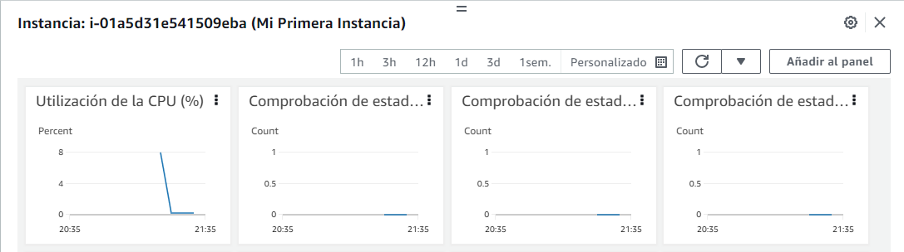

https://www.youtube.com/watch?v=mrUqITjUhL8

---

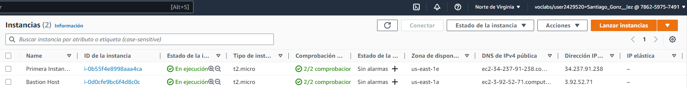

- Dirección IP v4 pública: 34.237.91.238
- Dirección IP v4 privada: 172.31.50.94
- Tipo de Instancia: t2.micro
- Plataforma: Amazon Linux (inferido)
  - Detalles de la plataforma: Linux/UNIX
- Tipo de virtualización: hvm
- Número de CPU virtuales: 1
- Zona de disponibilidad: us-east-1e
- ID de volumen: vol-062986804c24da795

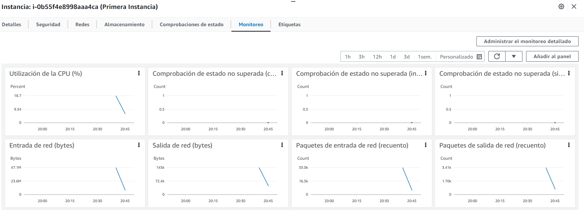

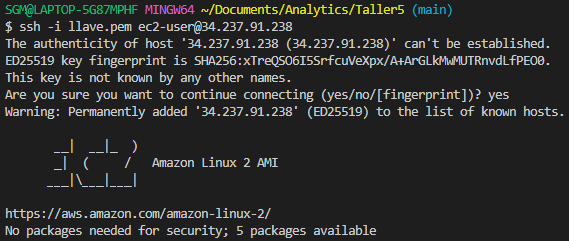

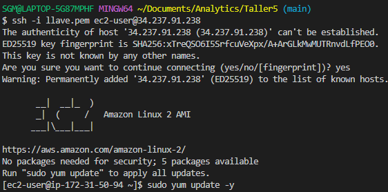

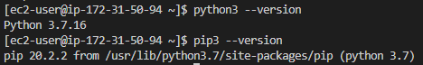

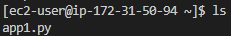

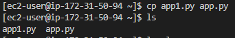

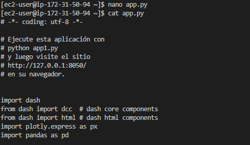

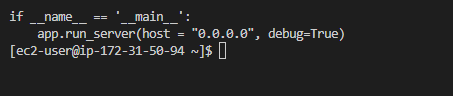

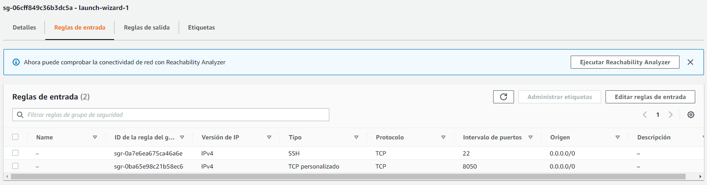

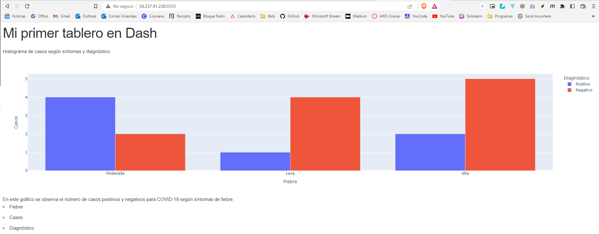
